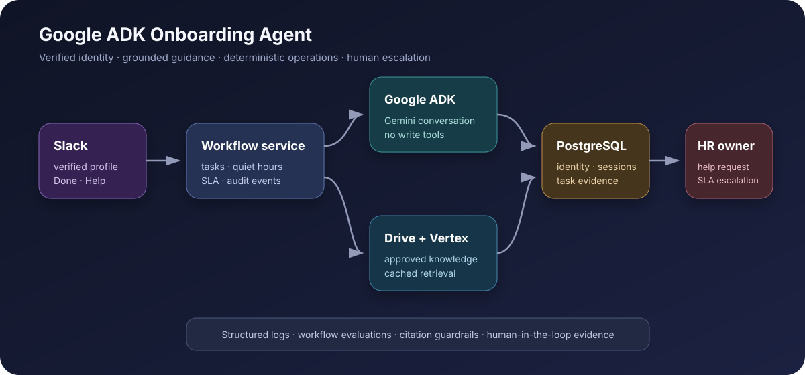

# Google ADK Onboarding Agent



A multilingual employee onboarding operations agent built with **Google ADK, Gemini, Slack,
Google Drive, Vertex AI, and PostgreSQL**. It proactively welcomes verified new hires, retrieves
approved company guidance, delivers role-specific tasks, respects quiet hours, records progress,
detects blockers, and escalates help or SLA breaches to a human onboarding owner.

This repository contains the backend and integration pattern only—no frontend.

## Why this is more than an HR chatbot

The agent participates in an operational journey:

```text
Verified Slack employee
        ↓
Official Drive welcome + citation
        ↓
Readiness and quiet-hours check
        ↓
Role-specific task from PostgreSQL
   ↙                         ↘
Done                         Help
 ↓                            ↓
Progress update         Human owner notified
        ↓
Next task + SLA monitoring
```

Google ADK handles multilingual conversation, intent, sentiment, and grounded answers. Deterministic
code controls identity, task assignment, completion, reminders, and human escalation. The model has
no database-writing tools.

## Portfolio evidence

- Georgian, English, and Russian interaction routing
- Verified Slack identity binding instead of trusting model-extracted email
- Google ADK structured-output adapter using Gemini
- Cached semantic retrieval from approved Google Drive documents with Vertex embeddings
- PostgreSQL task snapshots, session state, SLA events, and completion evidence
- Quiet-hours enforcement for task delivery and reminders
- Human help and overdue-task escalation
- Local zero-cost demo mode, tests, workflow evaluations, CI, and Docker packaging

Read the [case study](docs/CASE_STUDY.md), [architecture decisions](docs/ARCHITECTURE.md), and
[security baseline](docs/SECURITY.md).

## Run the complete local demo

Prerequisites: Python 3.11+ and [uv](https://docs.astral.sh/uv/).

```bash
uv sync --extra dev
uv run uvicorn onboarding_agent.api:app --reload
```

Open `http://127.0.0.1:8000/docs`. The default local mode uses fictional employee data, a
deterministic agent, an in-memory repository, and a fixed daytime clock. It does not require cloud
credentials or make external calls.

Suggested journey:

1. `POST /demo/start` with the default verified employee.
2. `POST /demo/chat` with `{"message":"ready"}`.
3. Ask `What is the security policy?`.
4. Use `POST /demo/help` or `POST /demo/done`.
5. Run `POST /operations/sla-sweep` to inspect the operational endpoint.

## Quality gates

```bash
uv run ruff check .
uv run ruff format --check .
uv run pytest -q
uv run onboarding-eval
```

The evaluation suite checks verified welcome delivery, task assignment, grounded citations, and
human escalation.

## Enable live integrations

```bash
cp .env.example .env
uv sync --extra integrations --extra dev
```

Set `ONBOARDING_RUNTIME_MODE=live` and supply runtime secrets through your deployment platform.
Apply [the PostgreSQL migration](migrations/001_initial.sql), seed an approved task template and
employee, install the Slack app in Socket Mode, and share only the approved Drive folder with the
service account.

Start the live Slack worker:

```bash
uv run python -m onboarding_agent.slack_app
```

The Slack worker obtains the email from Slack's authenticated profile API. A user-entered email is
never accepted as identity proof.

## Main components

| Component | Responsibility |
|---|---|
| `OnboardingService` | Deterministic employee journey, task state, quiet hours, help, SLA |
| `GoogleAdkConversationAgent` | Gemini conversation with structured output and no write tools |
| `GoogleDriveKnowledgeBase` | Cached Drive ingestion and Vertex semantic retrieval |
| `PostgresEmployeeRepository` | Identity, sessions, tasks, progress, and audit events |
| `SlackNotifier` / Slack worker | Verified channel, interactive actions, human notifications |
| Local adapters | Credential-free demo, CI, and repeatable interview walkthrough |

## Production path

The supplied container can run the API on Cloud Run, GKE, ECS/Fargate, or another container
platform. Run the Slack Socket Mode worker as a separate process. In a scaled deployment, replace
in-process scheduler ownership with one durable scheduled job and move the knowledge cache to a
persistent vector index such as pgvector.

Before using employee data, establish an approved privacy notice, access model, retention schedule,
human review policy, and controls for sentiment-derived data.

## Origin

This repository is a cleaned portfolio evolution of an onboarding prototype that combined Google
ADK, Gemini 2.0 Flash, Slack, PostgreSQL/Supabase, Google Drive retrieval, multilingual responses,
task buttons, session tracking, and an SLA watchdog. The original local project and its credentials
are not included or modified.
